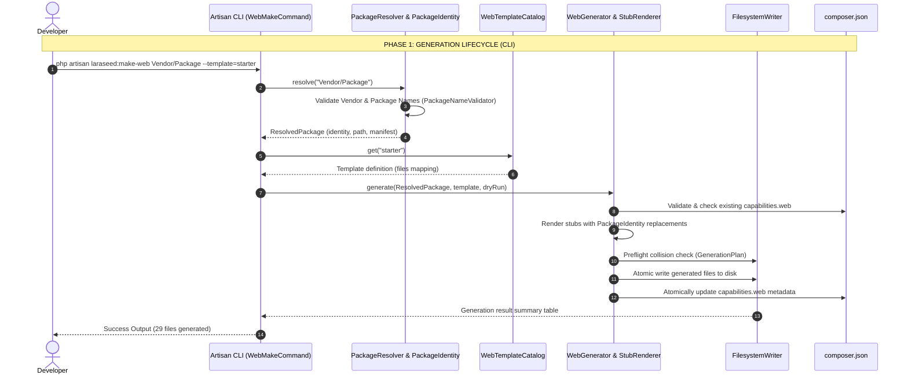
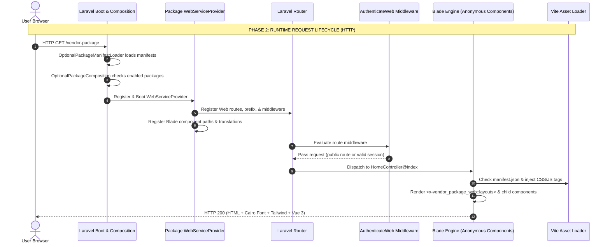

# Laraseed Generator V3 — Architecture & System Lifecycle

This document provides the definitive architectural reference for **Laraseed Generator V3**, detailing the complete generation and runtime lifecycle, class responsibilities, package composition mechanisms, isolation boundaries, and system interactions.

---

## 1. Architectural Overview & Core Entities

To understand Laraseed Generator V3, developers must distinguish between six core architectural concepts:

```
+-----------------------------------------------------------------------------------+
|                                LARASEED ECOSYSTEM                                 |
+-----------------------------------------------------------------------------------+
|  [ Generator V2 ] ---------> Scaffolds Base Package + Admin Capabilities          |
|  [ Generator V3 ] ---------> Scaffolds Standalone Web Capabilities & Templates    |
|                                                                                   |
|  [ Package ] --------------> Isolated module (packages/Vendor/PackageName)        |
|  [ Capability ] -----------> Pluggable domain slice (admin, web, api, etc.)      |
|  [ Template ] -------------> Set of UI stubs in WebTemplateCatalog (e.g. starter) |
|  [ Generated Website ] ----> Autonomous public frontend running inside a package  |
+-----------------------------------------------------------------------------------+
```

### Core Concept Definitions

1. **Generator V2:**  
   The scaffolding engine responsible for creating base modular packages (`laraseed:make-package`) and Admin capabilities (`laraseed:make-admin`, DataGrids, Repositories, Models, Migrations, ACL rules). It focuses on backend domain entities and admin management interfaces.

2. **Generator V3:**  
   The presentation scaffolding engine (`laraseed:make-web`) that attaches autonomous, public-facing or portal-facing Web capabilities to existing packages using selected UI templates, independent Vite pipelines, and decoupled authentication.

3. **A Package (`packages/{Vendor}/{Package}`):**  
   An isolated unit of code adhering to Foundation package rules. It contains its own `composer.json`, service providers, migrations, configuration, and tests. Packages have no direct dependency on the root application namespace.

4. **A Web Capability (`src/Web/`):**  
   A declarative slice within a package registered in `composer.json` under `extra.laraseed.capabilities.web`. It is loaded by `WebServiceProvider` only when the parent package is enabled.

5. **A Template (`WebTemplateCatalog`):**  
   A declarative blueprint comprising a catalog registry entry and a directory of stubs (`stubs/templates/{template_id}/`) defining layout, components, views, styles, translations, and scripts.

6. **A Generated Website:**  
   The resulting functional web application compiled and served from a package's Web capability, featuring isolated routes, views, Vite assets, and bilingual content.

---

## 2. Complete Generation & Runtime Lifecycle

The lifecycle spans two distinct phases: **Generation Time (CLI)** and **Execution Time (HTTP Request)**.





---

## 3. Concrete Class Responsibilities

Every step in Generator V3 is handled by dedicated, single-responsibility classes:

### 3.1 Scaffolding & Command Infrastructure

| Class | Full Qualified Namespace | Primary Responsibility |
| :--- | :--- | :--- |
| `WebMakeCommand` | `Laraseed\PackageGenerator\Console\Commands\WebMakeCommand` | Handles the `php artisan laraseed:make-web` console command, parses CLI options (`--template`, `--dry-run`), and renders console output tables. |
| `PackageMakeCommand` | `Laraseed\PackageGenerator\Console\Commands\PackageMakeCommand` | Handles `php artisan laraseed:make-package` to scaffold the base package structure. |
| `WebTemplateCatalog` | `Laraseed\PackageGenerator\Templates\WebTemplateCatalog` | In-memory registry containing all registered template definitions, descriptions, and file-to-stub mappings. |
| `WebGenerator` | `Laraseed\PackageGenerator\Generators\WebGenerator` | Orchestrates template resolution, stub rendering, preflight collision detection, atomic file generation, and transactional rollback on write failure. |
| `PackageResolver` | `Laraseed\PackageGenerator\Support\PackageResolver` | Locates and validates target package directories and verifies valid `composer.json` metadata. |
| `PackageIdentity` | `Laraseed\PackageGenerator\Support\PackageIdentity` | Normalizes package input strings into various case formats (`packageSnake`, `vendorKebab`, `namespace`, `composerName`, etc.). |
| `PackageNameValidator` | `Laraseed\PackageGenerator\Support\PackageNameValidator` | Prevents directory traversal (`..`), reserved names (`webkul`, `core`, `admin`), and invalid namespace identifiers. |
| `StubRenderer` | `Laraseed\PackageGenerator\Generators\StubRenderer` | Loads `.stub` files from disk and performs placeholder replacements (`{{ PACKAGE_KEY }}`, `{{ NAMESPACE }}`, etc.). |
| `GenerationPlan` | `Laraseed\PackageGenerator\Generators\GenerationPlan` | Represents the set of files to be created and runs collision preflights. |
| `FilesystemWriter` | `Laraseed\PackageGenerator\Generators\FilesystemWriter` | Safely creates directories and writes files to disk, supporting dry-run simulations. |

### 3.2 Runtime & Composition Infrastructure

| Class | Full Qualified Namespace | Primary Responsibility |
| :--- | :--- | :--- |
| `OptionalPackageManifestLoader` | `Webkul\Core\Packages\OptionalPackageManifestLoader` | Scans all `packages/*/*/composer.json` files and extracts package identity and capability providers. |
| `OptionalPackageComposition` | `Webkul\Core\Packages\OptionalPackageComposition` | Resolves which packages and capabilities (`admin`, `web`) are active based on environment configuration. |
| `AuthenticationRedirectResolver` | `Webkul\Core\Contracts\AuthenticationRedirectResolver` | Evaluates HTTP requests to determine whether unauthenticated guests should redirect to Admin or a specific Web package login route. |
| `WebServiceProvider` | `{Vendor}\{Package}\Web\Providers\WebServiceProvider` | Package-owned service provider that merges config, registers Blade component namespaces, loads views/translations, and registers Web routes. |
| `AuthenticateWeb` | `{Vendor}\{Package}\Web\Http\Middleware\AuthenticateWeb` | Package-owned middleware enforcing guard authentication on protected routes without corrupting global authentication. |

---

## 4. Package Composition Architecture

Laraseed does not hardcode package providers in `bootstrap/providers.php`. Instead, it uses dynamic capability composition:

```
                                  +---------------------------------------+
                                  |     LARASEED_OPTIONAL_PACKAGES        |
                                  |         (in .env or config)           |
                                  +---------------------------------------+
                                                      |
                                                      v
                                  +---------------------------------------+
                                  |     OptionalPackageManifestLoader     |
                                  |    Scans packages/*/*/composer.json   |
                                  +---------------------------------------+
                                                      |
                                                      v
                                  +---------------------------------------+
                                  |      OptionalPackageComposition       |
                                  +---------------------------------------+
                                        /                           \
                                       /                             \
        +------------------------------------+        +------------------------------------+
        |        Base Package Provider       |        |      Capability Web Provider       |
        |    Vendor\Package\Providers\...    |        | Vendor\Package\Web\Providers\...   |
        +------------------------------------+        +------------------------------------+
```

### The 4 Composition Quadrants

Every optional package capability operates under a 4-quadrant state matrix:

1. **Quadrant 1 (Package ON + Capability ON):**  
   The package is listed in `LARASEED_OPTIONAL_PACKAGES` and `capabilities.web.enabled` is `true`. `WebServiceProvider` boots, registering routes, views, assets, and middleware.
2. **Quadrant 2 (Package ON + Capability OFF):**  
   The package is active, but `capabilities.web.enabled` is `false` in `composer.json`. Base package services boot, but all Web routes and views remain inactive.
3. **Quadrant 3 (Package OFF + Capability ON):**  
   The package manifest has `capabilities.web.enabled = true`, but the package ID is not listed in `LARASEED_OPTIONAL_PACKAGES`. Neither the base package nor the Web capability boots.
4. **Quadrant 4 (Package OFF + Capability OFF):**  
   Completely inert. Zero code is loaded into memory.

---

## 5. Strict Architectural Boundaries

To preserve stability, security, and portability across packages, developers and templates must observe the following inviolable boundaries:

### Rule 1: Zero Mutation to Foundation
- **NEVER** edit files inside `packages/Webkul/*` or `packages/Laraseed/Contacts`.
- **NEVER** add package-specific providers to `bootstrap/providers.php`.
- **NEVER** modify root `routes/web.php` or root `config/auth.php` during package scaffolding.

### Rule 2: Asset Namespace Isolation
- **NEVER** write package CSS or JS into root `resources/css` or `resources/js`.
- **NEVER** overwrite another package's build directory in `public/`.
- Every package MUST output to `public/{package-slug}/web/build/` and use its own hot file `public/{package-key}-web-vite.hot`.

### Rule 3: Autonomous Component Namespacing
- All Blade components MUST be referenced via their package namespace:  
  `<x-{package_key}_web::container>`  
  `<x-{package_key}_web::button>`
- Templates must NEVER register or rely on global component tags (e.g. `<x-button>`), which causes tag collisions when multiple Web packages are installed.

### Rule 4: Route Name & Prefix Ownership
- All package routes MUST use the named prefix `{package_key}.web.*`.
- Route prefixes default to `{package-slug}`. When claiming root `/` (`prefix => ''`), only one package may do so at a time. The system enforces this via `laraseed.web.root_owner`.

### Rule 5: Authentication Guard Isolation
- Web capabilities MUST NOT force usage of the `admin` guard.
- Protected Web routes must use custom or configured guards (e.g. `customer`, `member`, `user`) and MUST authenticate via the package-owned middleware alias `{package_key}_auth`.
- Unauthenticated guest redirects must never hijack Admin routes (`/admin/*`) or peer package routes.
