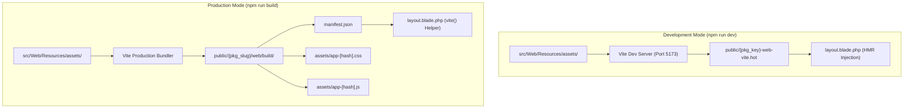

# Laraseed Generator V3 — Styling & Frontend Asset Pipeline

This document explains the frontend architecture, Vite bundling pipeline, Tailwind CSS configuration, typography, dark mode handling, and asset isolation mechanisms in **Laraseed Generator V3**.

---

## 1. Frontend Architecture & Tooling Stack

Each generated Web capability contains an autonomous, self-contained frontend build system located entirely within the package directory:

```
packages/Vendor/Package/
├── package.json          (Isolated NPM dependencies)
├── vite.config.js        (Package-scoped Vite configuration)
├── tailwind.config.js    (Package Tailwind content scanning & theme)
├── postcss.config.js     (PostCSS Tailwind & Autoprefixer plugin setup)
└── src/Web/Resources/
    └── assets/
        ├── css/
        │   └── app.css   (Tailwind layers, Cairo font, button classes)
        └── js/
            └── app.js    (Vue 3 initialization, dark mode cookie toggle)
```

### Core Technologies
- **Vite (v5+):** Ultra-fast compilation and Hot Module Replacement (HMR).
- **Tailwind CSS (v3+):** Utility-first CSS framework with `class`-based dark mode.
- **Cairo Font:** Arab-Latin typography optimized for bilingual readability.
- **Vue 3:** Lightweight reactive runtime mounted to `#app`.

---

## 2. The Build Pipeline: Development vs. Production



### 2.1 Development Mode (`npm run dev`)
- Starts the local Vite development server with Hot Module Replacement.
- Creates a temporary hot file in the application public root:  
  `public/{package_key}-web-vite.hot`
- When detected by `layout.blade.php`, asset scripts are injected pointing directly to Vite's local dev server (`http://localhost:5173`).

### 2.2 Production Mode (`npm run build`)
- Compiles, minifies, and tree-shakes CSS and JavaScript.
- Outputs versioned, cache-busted bundles and a `manifest.json` into:  
  `public/{package_slug}/web/build/`
- The `manifest.json` maps source paths to compiled hashed filenames:
  ```json
  {
    "src/Web/Resources/assets/css/app.css": {
      "file": "assets/app-C_z9kH2D.css",
      "src": "src/Web/Resources/assets/css/app.css",
      "isEntry": true
    },
    "src/Web/Resources/assets/js/app.js": {
      "file": "assets/app-DU_wV2j8.js",
      "src": "src/Web/Resources/assets/js/app.js",
      "isEntry": true
    }
  }
  ```

---

## 3. Package Asset Isolation

When multiple Web packages are installed in the same Laraseed application (e.g. `Acme/Portal` and `Beta/Store`), their assets must never conflict:

| Asset Dimension | `Acme/Portal` | `Beta/Store` |
| :--- | :--- | :--- |
| **Package Slug** | `acme-portal` | `beta-store` |
| **Package Key** | `acme_portal` | `beta_store` |
| **Build Directory** | `public/acme-portal/web/build/` | `public/beta-store/web/build/` |
| **Hot File** | `public/acme_portal-web-vite.hot` | `public/beta_store-web-vite.hot` |
| **Vite Config Key** | `krayin-vite.viters.acme_portal_web` | `krayin-vite.viters.beta_store_web` |

### How Vite Resolves Package Assets in Blade
In `WebServiceProvider::register()`:
```php
config([
    'krayin-vite.viters.{{ PACKAGE_KEY }}_web' => [
        'hot_file'                 => '{{ PACKAGE_KEY }}-web-vite.hot',
        'build_directory'          => '{{ PACKAGE_SLUG }}/web/build',
        'package_assets_directory' => 'src/Web/Resources/assets',
    ],
]);
```

In `layout.blade.php`:
```blade
{{
    vite()->set([
        'src/Web/Resources/assets/css/app.css',
        'src/Web/Resources/assets/js/app.js'
    ], '{{ PACKAGE_KEY }}_web')
}}
```

---

## 4. Typography & Styling Features

### 4.1 Cairo Typography
The Starter template defines Cairo as the primary font family in `app.css` and `tailwind.config.js`:
```css
/* app.css */
@font-face {
    font-family: 'Cairo';
    font-weight: 400;
    font-style: normal;
    font-display: swap;
}

:root, body {
    font-family: 'Cairo', ui-sans-serif, system-ui, -apple-system, 'Segoe UI', Roboto, Arial, sans-serif;
}
```

### 4.2 Dynamic Branding & CSS Variables
The primary visual brand color is defined in `config/web.php` and injected into the `:root` pseudo-class in `layout.blade.php`:
```blade
<style>
    :root {
        --brand-color: {{ config('{{ PACKAGE_KEY }}_web.branding.color', '#0E90D9') }};
    }
</style>
```

In `tailwind.config.js`, Tailwind extends its color palette to bind `brandColor` directly to the CSS variable:
```javascript
theme: {
    extend: {
        colors: {
            brandColor: "var(--brand-color, #0E90D9)",
        },
    },
}
```

### 4.3 Dark Mode Implementation
- Configured via Tailwind class strategy (`darkMode: "class"`).
- Persisted across HTTP requests using a client-side cookie (`dark_mode=1|0`).
- The HTML root applies the `dark` class automatically on server render:
  ```blade
  <html class="{{ request()->cookie('dark_mode') ? 'dark' : '' }}" ...>
  ```
- The header toggle button flips the class and updates the cookie synchronously without page reloads.

---

## 5. Diagnostic Banner for Uncompiled Assets

To provide an exceptional developer experience, `layout.blade.php` automatically detects whether assets have been built:

```blade
@php
    $assetsBuilt = file_exists(public_path('{{ PACKAGE_KEY }}-web-vite.hot')) ||
                   file_exists(public_path('{{ PACKAGE_SLUG }}/web/build/manifest.json'));
@endphp

@if (! $assetsBuilt)
    <aside class="bg-amber-600 text-white text-xs font-semibold px-4 py-2.5 text-center shadow-md flex items-center justify-center gap-2" role="alert" style="background-color: #d97706; color: #ffffff; padding: 0.625rem 1rem; text-align: center; font-size: 0.875rem; font-weight: 600; position: relative; z-index: 50;">
        <svg class="h-5 w-5 inline-block" style="width: 1.25rem; height: 1.25rem; vertical-align: middle;" fill="none" stroke="currentColor" viewBox="0 0 24 24">
            <path stroke-linecap="round" stroke-linejoin="round" stroke-width="2" d="M12 9v2m0 4h.01m-6.938 4h13.856c1.54 0 2.502-1.667 1.732-3L13.732 4c-.77-1.333-2.694-1.333-3.464 0L3.34 16c-.77 1.333.192 3 1.732 3z"/>
        </svg>
        <span>[Laraseed Diagnostic] Frontend assets for <strong>{{ '{{ PACKAGE_TITLE }}' }}</strong> are not built. Run <code>npm run build</code> or <code>npm run dev</code> in <code>packages/{{ '{{ VENDOR }}' }}/{{ '{{ PACKAGE }}' }}</code>.</span>
    </aside>
@endif
```

> [!NOTE]
> Inline defensive styles ensure that SVG icons and alert containers maintain proper dimensions and layout even when zero CSS has been compiled.

---

## 6. Diagnostic Procedure: Missing or Broken Styles

If a generated package renders without styles:

1. **Check for the Diagnostic Banner:**  
   If the amber banner appears at the top of the browser, assets have not been built. Navigate to the package directory and run `npm run build`.
2. **Verify Manifest Existence:**  
   Confirm `public/{package_slug}/web/build/manifest.json` exists and is readable.
3. **Check Web Server Symlinks / Permissions:**  
   Ensure the `public/` directory is writable by the web server process.
4. **Purge Browser Cache:**  
   Hard refresh (`Ctrl + F5` / `Cmd + Shift + R`) to bypass cached stylesheets.

---

## 7. Build Success vs. Verified Browser Rendering

A successful CLI build (`npm run build` exiting with code 0) does **not** guarantee complete visual integrity. 

Developers must certify:
- **Responsive Breakpoints:** Verification on mobile (390px), tablet (768px), and desktop (1440px).
- **RTL Alignment:** Verification that Arabic text aligns properly (`text-start`), icon margins mirror correctly, and drawer slides from the expected side.
- **Dark Mode Contrast:** Verification that all text elements remain legible in dark mode without low-contrast anomalies.
