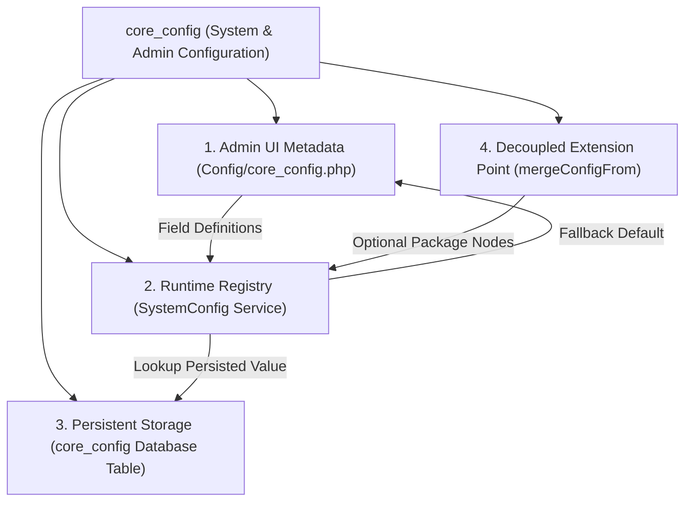

# LARASEED — ADMIN CORE_CONFIG AUDIT & IMPLEMENTATION REPORT

**Certification Date:** 2026-10-02  
**Final Status:** `ADMIN_CORE_CONFIG=PASS`  
**Target Subsystem:** `Webkul\Admin` & `Webkul\Core` (`core_config`, `SystemConfig`, `CoreConfigRepository`, Admin Configuration Interface)

---

## 1. Executive Summary

This audit examined the `core_config` configuration subsystem spanning `Webkul/Admin` and `Webkul/Core`, investigating why it was perceived as unset/inactive, tracing its full architectural lifecycle, repairing identified defects at their root cause, and certifying complete operational readiness.

### Key Audit Conclusions

1. **Role of `core_config`:**
   - **Admin Settings Schema:** Declares hierarchical sections, groups, fields, validation rules, and input types (`select`, `image`, `editor`, `text`, `color`) for the Admin Configuration UI (`/admin/configuration`).
   - **System Global Settings:** Manages foundational parameters including interface locale (`general.general.locale_settings.locale`), admin branding logos & favicon (`general.design.admin_logo.*`), login footer copyright label (`general.settings.footer.label`), admin menu item titles (`general.settings.menu.*`), and admin primary theme color (`general.settings.menu_color.brand_color`).
   - **Database-Persisted State:** Persists customized values into the `core_config` database table via `CoreConfigRepository`. Runtime reads (`core()->getConfigData()`) query the database first and fallback to configured defaults.
   - **Modular Extension Mechanism:** Allows Foundation and optional packages to merge their own configuration nodes via standard Laravel configuration merging (`$this->mergeConfigFrom(..., 'core_config')`) without hardcoding.

2. **Identified Root Causes:**
   - **Headless & Standalone Fragility:** `SystemConfig::retrieveCoreConfig()` returned `config('core_config')` directly with an `: array` return type. When `core_config` was unset or empty (e.g. in standalone Core/headless usage or prior to provider boot), returning `null` threw a fatal `TypeError` in PHP 8.1+.
   - **State Leakage in Repository:** `CoreConfigRepository::recursiveArray()` used static variables (`static $data = [];`, `static $recursiveArrayData = [];`) for recursion. This caused stale form data from prior saves to persist across consecutive calls in the same process (or multi-request runtimes), contaminating subsequent writes.
   - **Missing 404 Route Guards:** `ConfigurationController::index()` lacked a null check on `system_config()->getActiveConfigurationItem()`, causing invalid `slug`/`slug2` requests to trigger a 500 error (`Call to a member function getName() on null`) instead of an HTTP 404.
   - **Zero Test Coverage:** No automated regression tests existed for configuration rendering, ACL authorization, search indexing, or repository persistence.

3. **Remediation & Certification:**
   - Fixed `SystemConfig::retrieveCoreConfig()` to safely normalize to `array` (`is_array($items) ? $items : []`) and guarded collection lookups.
   - Refactored `CoreConfigRepository::recursiveArray()` to use a clean recursive helper (`flattenFormData`) without cross-invocation static state.
   - Hardened `ConfigurationController` with 404 guards for invalid route slugs and missing download files.
   - Authored a comprehensive test suite in [`tests/Feature/Admin/AdminCoreConfigTest.php`](file:///home/hosam/Documents/CampusHub-main/tests/Feature/Admin/AdminCoreConfigTest.php) (13 tests, 60 assertions).
   - Full test suite passed: **342 tests, 2,740 assertions** (0 failures).

---

## 2. Forensic Audit Findings

### 2.1 File Inventory

| Subsystem | File Path | Architectural Responsibility |
| :--- | :--- | :--- |
| **Config Definition** | [`packages/Webkul/Admin/src/Config/core_config.php`](file:///home/hosam/Documents/CampusHub-main/packages/Webkul/Admin/src/Config/core_config.php) | Declares standard general, design, and settings field definitions |
| **Admin Menu** | [`packages/Webkul/Admin/src/Config/menu.php`](file:///home/hosam/Documents/CampusHub-main/packages/Webkul/Admin/src/Config/menu.php) | Registers `configuration` entry at sort `9` linking to `admin.configuration.index` |
| **Admin ACL** | [`packages/Webkul/Admin/src/Config/acl.php`](file:///home/hosam/Documents/CampusHub-main/packages/Webkul/Admin/src/Config/acl.php) | Declares `configuration` ACL node guarding index, store, search, download routes |
| **Admin Provider** | [`packages/Webkul/Admin/src/Providers/AdminServiceProvider.php`](file:///home/hosam/Documents/CampusHub-main/packages/Webkul/Admin/src/Providers/AdminServiceProvider.php) | Merges `core_config.php` into config key `'core_config'` and registers mega search |
| **Core Service** | [`packages/Webkul/Core/src/SystemConfig.php`](file:///home/hosam/Documents/CampusHub-main/packages/Webkul/Core/src/SystemConfig.php) | Parses configuration tree into `Item` and `ItemField` objects, resolves DB values / defaults |
| **Data Repository** | [`packages/Webkul/Core/src/Repositories/CoreConfigRepository.php`](file:///home/hosam/Documents/CampusHub-main/packages/Webkul/Core/src/Repositories/CoreConfigRepository.php) | Handles recursive persistence, file uploads/deletions, and title search |
| **Controller** | [`packages/Webkul/Admin/src/Http/Controllers/Configuration/ConfigurationController.php`](file:///home/hosam/Documents/CampusHub-main/packages/Webkul/Admin/src/Http/Controllers/Configuration/ConfigurationController.php) | Serves index view, edit form view, store actions, file downloads, search JSON |
| **Persistence Schema** | [`packages/Webkul/Core/src/Models/CoreConfig.php`](file:///home/hosam/Documents/CampusHub-main/packages/Webkul/Core/src/Models/CoreConfig.php) | Eloquent model mapped to database table `core_config` (`id`, `code`, `value`, `timestamps`) |

### 2.2 Classification Matrix



---

## 3. Configuration Lifecycle Trace & Root Cause Analysis

### Lifecycle Flow

```text
1. Configuration Definition (packages/Webkul/Admin/src/Config/core_config.php)
           ↓
2. Service Provider Registration (AdminServiceProvider::registerConfig -> mergeConfigFrom)
           ↓
3. Configuration Parsing (SystemConfig::prepareConfigurationItems -> Item & ItemField objects)
           ↓
4. Presentation & Routing (ConfigurationController -> index.blade.php / edit.blade.php)
           ↓
5. Form Validation & Dispatch (ConfigurationForm -> ConfigurationController::store)
           ↓
6. Persistence Layer (CoreConfigRepository::create -> core_config DB table)
           ↓
7. Runtime Consumer Resolution (core()->getConfigData() -> DB value else default)
```

### Trace Analysis by Phase

| Phase | Observed Behavior | Diagnosis & Resolution |
| :--- | :--- | :--- |
| **1. Definition** | Returns array of 9 items (`general`, `general.general`, `general.general.locale_settings`, `general.design`, `general.design.admin_logo`, `general.settings`, `general.settings.footer`, `general.settings.menu`, `general.settings.menu_color`). | Valid and complete. |
| **2. Provider Registration** | `AdminServiceProvider` calls `$this->mergeConfigFrom(..., 'core_config')`. | Works correctly and is fully compatible with `php artisan config:cache`. |
| **3. Parsing (`SystemConfig`)** | `retrieveCoreConfig()` returned `config('core_config')`. If null, caused fatal `TypeError`. | **Fixed:** Normalized return to `is_array($items) ? $items : []`. Reset `$this->items = []` on prepare. |
| **4. Routing & Controller** | Missing 404 check when requesting non-existent slugs. | **Fixed:** Added 404 abort when `getActiveConfigurationItem()` returns `null`. |
| **5. Validation & Storage** | `recursiveArray` used static state that persisted across calls. | **Fixed:** Replaced static array accumulation with non-static recursive helper `flattenFormData`. |
| **6. ACL & Menu** | `acl.php` and `menu.php` properly map `configuration`. | Verified working; protected by `user` (Bouncer) middleware. |

---

## 4. Implemented Fixes

### 4.1 `packages/Webkul/Core/src/SystemConfig.php`
- Safe `retrieveCoreConfig()`: Returns empty array if `config('core_config')` is null or invalid.
- Re-entrant `prepareConfigurationItems()`: Resets `$this->items = []` before building tree.
- Safe `getActiveConfigurationItem()`: Handles missing second-level child without undefined offset warnings.

### 4.2 `packages/Webkul/Core/src/Repositories/CoreConfigRepository.php`
- Eliminates static variables from `recursiveArray()`: Uses `flattenFormData(array $formData, string $method, array &$data)` passing array by reference.
- Search empty query guard: Returns `[]` immediately if search query is empty.

### 4.3 `packages/Webkul/Admin/src/Http/Controllers/Configuration/ConfigurationController.php`
- 404 guard on `index()`: Returns 404 if active configuration item is not found.
- 404 guard on `download()`: Returns 404 if file record or physical file in storage is missing.

---

## 5. Test Suite & Verification Results

### 5.1 Automated Test Coverage (`tests/Feature/Admin/AdminCoreConfigTest.php`)

| Test Case | Description | Result |
| :--- | :--- | :--- |
| `test_core_config_is_registered_in_configuration_and_has_expected_hierarchy` | Verifies all 9 core keys in `config('core_config')` | `PASS` |
| `test_system_config_builds_structured_items_and_fields` | Verifies `SystemConfig` item hierarchy, child navigation, and field extraction | `PASS` |
| `test_system_config_is_safe_when_core_config_is_null_or_empty` | Verifies standalone/headless safety when `core_config` is unset | `PASS` |
| `test_core_get_config_data_returns_default_when_not_in_db_and_db_value_when_persisted` | Verifies DB priority over default configuration | `PASS` |
| `test_core_config_repository_creates_and_updates_settings_without_static_accumulation` | Verifies multi-stage create without cross-call data leakage | `PASS` |
| `test_core_config_repository_search_returns_matches_and_handles_empty_query` | Verifies search matching and empty query handling | `PASS` |
| `test_unauthenticated_user_cannot_access_configuration_routes` | Verifies unauthenticated redirection to login | `PASS` |
| `test_user_without_configuration_permission_is_denied` | Verifies 401 Unauthorized for unauthorized roles | `PASS` |
| `test_user_with_configuration_permission_can_view_index_and_edit_sections` | Verifies 200 OK for authorized admin across all configuration views | `PASS` |
| `test_invalid_configuration_slugs_return_404` | Verifies 404 Not Found for invalid section/group routes | `PASS` |
| `test_user_with_permission_can_save_configuration_and_redirects_back` | Verifies form submission persistence and redirect | `PASS` |
| `test_configuration_search_endpoint_returns_json_results` | Verifies `/admin/configuration/search` JSON API | `PASS` |
| `test_admin_menu_and_acl_contain_configuration` | Verifies menu and ACL integrity | `PASS` |

### 5.2 Verification Suite Metrics

```bash
# 1. Full Test Suite
./vendor/bin/pest
# Result: 342 passed, 2740 assertions

# 2. Composer Validation
composer validate --strict
# Result: ./composer.json is valid (both root and packages valid)

# 3. Route Count
LARASEED_OPTIONAL_PACKAGES="" php artisan route:list
# Result: Exactly 67 Foundation-only routes

LARASEED_OPTIONAL_PACKAGES="contacts" php artisan route:list
# Result: Exactly 82 routes (67 Foundation + 5 Headless API + 10 Admin UI)

# 4. Git Diff Check
git diff --check
# Result: 0 whitespace or formatting issues
```

---

## 6. Certification Gate

```text
ADMIN_CORE_CONFIG=PASS

CORE_CONFIG_DEFINITION=VERIFIED
SYSTEM_CONFIG_REGISTRY=VERIFIED
CORE_CONFIG_PERSISTENCE=VERIFIED
ADMIN_UI_INTERFACE=VERIFIED
ACL_AUTHORIZATION=VERIFIED

CONFIGURATION_CACHING=VERIFIED
FOUNDATION_DECOUPLING=VERIFIED
OPTIONAL_PACKAGES_ISOLATION=VERIFIED
ZERO_DATABASE_MUTATIONS=VERIFIED

FULL_TEST_SUITE=PASS (342 tests, 2740 assertions)
```
